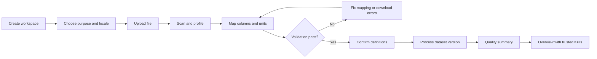
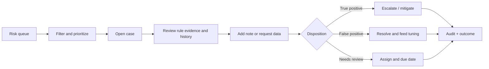

# PulseIQ Africa Product and UI/UX Blueprint

## 1. Product definition

### Product promise

PulseIQ turns a traceable, validated business or lending dataset into an explainable decision workspace. It helps a human reviewer understand portfolio performance, discover suspicious records, evaluate credit risk, document decisions, and deliver reports without hiding uncertainty or data limitations.

### Recommended initial wedge

Launch as a **B2B analyst/risk-review workspace for Nigerian SME lenders and finance teams**, with Ghana, Kenya, and Rwanda treated as later jurisdiction packs. This is narrower and safer than simultaneously serving SME owners, banks, fintechs, and every African market.

### Explicit non-goals for the first production release

- No fully automated loan approval or decline.
- No claim that uploaded transaction value equals accounting revenue unless mapped to a governed revenue definition.
- No cross-currency aggregation without currency and exchange-rate provenance.
- No model training from an unlabeled or derived target in a production workspace.
- No black-box anomaly or generative answer without a human-readable evidence trail.
- No microservices, real-time streaming, or multi-region active-active deployment before usage requires them.

## 2. Personas and jobs

| Persona | Core job | Needed outcome | Primary risk |
|---|---|---|---|
| Credit/Risk Officer | Review applicants and portfolio risk | Prioritized, explainable cases and defensible decisions | False approval/decline |
| Finance/Business Analyst | Turn files into performance insight | Trusted KPIs, trends, segments, exports | Incorrect definitions/data |
| SME Owner/Manager | Understand business health | Plain-language actions and report | Over-complexity |
| Team Lead/Approver | Govern thresholds and overrides | Review queue, policy control, auditability | Inconsistent decisions |
| Data Steward | Map and repair data | Clear validation and reusable mappings | Silent corruption |
| Organization Admin | Manage access and retention | Least privilege and compliance controls | Data exposure |
| Auditor/Compliance Reviewer | Reconstruct what happened | Immutable lineage and evidence | Missing provenance |

## 3. Product principles

1. **Truth before polish:** unavailable or invalid data is shown as unavailable, never silently converted into a healthy metric.
2. **Human accountability:** models and rules recommend; authorized people decide and can be challenged.
3. **Provenance everywhere:** every metric, flag, score, explanation, export, and report links to source data and a versioned computation.
4. **Progressive disclosure:** executives see outcomes; analysts can inspect definitions, rows, rules, and transformations.
5. **Low-bandwidth first:** core workflows remain usable on slow networks and modest devices.
6. **Local context:** currencies, number/date formats, language, market policy, and data residency are workspace settings.
7. **Accessible by default:** target WCAG 2.2 AA, keyboard parity, visible focus, non-color status cues, and table alternatives.

## 4. Information architecture

### Public and account surfaces

- Landing: problem, outcomes, trust, supported data, security, demo, contact.
- Documentation: data templates, metric definitions, model limitations, API, privacy.
- Authentication: sign in, MFA, password recovery/SSO, invite acceptance.
- Organization setup: name, country, currency, timezone, purpose, retention, team.

### Authenticated application

```text
Overview
Data
  Datasets
  Imports & mappings
  Data quality
Portfolio
  Performance
  Customers / applications
Risk
  Alerts
  Cases
Models
  Experiments
  Approved versions
Decisions
Reports
Assistant
Administration
  Team & roles
  Rules & thresholds
  Integrations
  Privacy & retention
  Audit log
```

For a small-screen layout, use a top bar plus a five-item primary navigation: Overview, Data, Risk, Decisions, More. On desktop, use a persistent labeled sidebar grouped by workflow. Do not mix sidebar and bottom navigation at the same hierarchy level.

## 5. Golden paths

### 5.1 First value from a CSV



Requirements:

- Show file size, row estimate, detected encoding/delimiter, and privacy notice before commit.
- Upload to object storage through a short-lived signed URL; do not route large bytes through the web process.
- Scan, fingerprint, and create an immutable dataset version.
- Suggest mappings but require confirmation for critical concepts: customer ID, transaction/application ID, date, amount, currency, direction, income period, target/outcome, observation date.
- Show a sample of source value → parsed value → normalized value.
- Block downstream modules until critical validation passes.
- Save mapping templates per source, with version and owner.
- Provide an error file containing row, column, value, rule, and recovery action.

### 5.2 Investigate an alert



Alert detail must display all triggered rules, severity per rule, evidence values, threshold and peer baseline, ruleset version, related records/customer history, assignee, service-level timer, notes, and disposition. A flag is not a case until a reviewer accepts it into the workflow.

### 5.3 Train and approve a model

1. Choose an eligible, frozen dataset version and authoritative target definition.
2. Review sample/class sufficiency, leakage checks, time window, excluded features, and protected-attribute policy.
3. Submit an asynchronous training job.
4. Compare candidates to a simple baseline using cross-validation and an untouched validation period.
5. Review discrimination, calibration, confusion/cost matrix, stability, subgroup performance, and explanation fidelity.
6. Create a model card and validation record.
7. Require separate approver for production promotion.
8. Shadow-score before activation; retain champion/challenger rollback.

### 5.4 Score and decide

1. Create or open an application/customer snapshot.
2. Validate required inputs and their evidence date.
3. Produce an immutable prediction with model version, probability, uncertainty, threshold band, top reason codes, and missingness indicators.
4. Present policy recommendation and model recommendation separately.
5. Require manual review when policy dictates, confidence is low, data is stale/incomplete, or the applicant requests reconsideration.
6. Record decision, approver, reason codes, override reason, timestamp, and customer communication.
7. Capture later repayment/outcome for monitoring without rewriting the original snapshot.

### 5.5 Report and deliver

1. Choose report type, dataset snapshot, period, filters, currency, and audience.
2. Preview contents and disclosures.
3. Generate asynchronously with a stable report ID and checksum.
4. Require approval for external distribution.
5. Download, email through an approved channel, or schedule delivery.
6. Log every generation, view, download, recipient, delivery result, and expiry.

## 6. Screen requirements

### Overview

- Dataset/source and last-refresh banner with quality status.
- Four to six primary KPI cards, each with definition, time period, comparison, unit, and data-health state.
- Portfolio trend with anomaly markers and a visible table alternative.
- Risk queue summary by urgency and status—not only severity.
- “What changed?” narrative linked to evidence.
- Primary action based on workspace state: Upload data, Fix quality, Review alerts, Approve model, or Generate report.

### Data / Imports

- Drag/drop plus browse, template download, connector option, and privacy notice.
- State machine: empty, selected, uploading, scanning, mapping, validating, ready, failed, quarantined.
- Dataset history, source, owner, fingerprint, rows, period, schema version, processing status.
- Mapping canvas with source column, concept, type/unit, sample values, validation status, and confidence.
- Quality issues grouped by completeness, validity, uniqueness, consistency, timeliness, and integrity.
- The prototype now expresses intake as four honest stages—upload source, confirm meaning, review quality, and use evidence—with explicit pending/current/ready/warning/blocked copy and responsive 4→2→1 column reflow.

### Portfolio

- Global date, region, segment, product, currency, and status filters.
- Active filter chips that wrap and expose full labels.
- KPI definitions and numerator/denominator details.
- Trends, distributions, cohorts, and segment comparison.
- Drill-down from aggregate to row while preserving filters and back state.
- Export current result with metadata and safe spreadsheet formatting.

### Risk alerts/cases

- Sortable/filterable server-side table with saved views.
- Severity + confidence + business impact + age + assignee.
- Bulk assignment/disposition with confirmation and undo where safe.
- Case drawer/detail route with all triggers and source evidence.
- SLA indicators, comments, attachments, escalation, and outcome.
- The prototype review queue now supports priority, triggered-rule, and customer/transaction filtering while preserving immutable rule output, displaying matching counts, and exporting only the visible evidence subset.

### Models

- Eligibility report before train.
- Training job progress with cancellation and logs safe for end users.
- Leaderboard with baseline, confidence intervals, validation period, target provenance, calibration, and cost metrics.
- Model card, feature contract, lineage, fairness/stability slices, approval status, deployment alias, and rollback.
- Never use accuracy as the default headline in an imbalanced credit problem.

### Decisions

- Single and batch score modes.
- Structured application form or imported snapshot; no placeholder-only labels.
- Separate data facts, model output, policy checks, and human decision.
- Reason codes tied to model/policy evidence.
- Override, appeal/reconsideration, and second-level approval flows.

### Reports

- Templates: Executive Portfolio, Risk Operations, Model Validation, Data Quality, Applicant Decision Record.
- Report period/filter/source preview and disclosures.
- Generation history with status, owner, hash, recipients, and expiration.
- Accessible HTML view as primary; tagged PDF and CSV/XLSX as secondary outputs.

### Assistant

- Suggested questions based on current page and permission.
- Every answer states dataset/version, period, filters, metric definition, and links to evidence.
- Ask clarifying questions for ambiguous currency, period, “revenue,” customer, or risk source.
- Refuse or constrain attempts to bypass access control, reveal another tenant, or make an unreviewed lending decision.
- Provide feedback controls and escalation to a human.
- Deterministic metric/query tools first; optional LLM only for language planning/synthesis.

### Administration

- Membership, role, last activity, invite/revoke, MFA/SSO enforcement.
- Versioned metric definitions, rule thresholds, decision policies, country pack, currency/timezone.
- Retention, legal hold, export/delete/DSAR operations.
- Integration credentials represented by status and scope, never secret value.
- Searchable audit log with export and tamper-evident retention.

## 7. Page and component states

Every data-bearing screen or component shall define:

- Initial/empty state with one meaningful next action.
- Loading state that reserves layout space; skeleton after ~300 ms, progress for long jobs.
- Partial state when some metrics are unavailable.
- Success state and confirmation.
- Validation state with inline field errors and focusable summary for multi-error forms.
- Permission-denied state that explains required role and support path.
- Stale-data state with last successful refresh.
- Offline/slow-network state with retry and preserved draft.
- Timeout/retry state with correlation ID.
- Destructive confirmation and recoverability/undo policy.

## 8. Design system direction

### Visual strategy

Use a light-first, high-trust financial workspace: quiet surfaces, strong information hierarchy, cobalt for primary action and selection, navy for identity and text, cyan for analytic series, and emerald only for healthy/approved states. Amber/red remain reserved for state. System, Light, and independently mapped Dark modes are now implemented in the prototype; light remains the print and reference palette rather than forcing a dark default.

The automated style search suggested a conservative enterprise gateway and technical Fira pairing. Retain the trust-first hierarchy, but reject a developer-tool aesthetic and monospace headings for the core product.

### Reference synthesis and selected layout

The supplied references contribute three useful ideas: the information density and left rail of the white/cobalt desktop dashboard, the compact bottom navigation of the cobalt mobile screens, and the restrained semantic green of the green analytics dashboard. PulseIQ must not reproduce their generic KPI composition or visual branding. Its distinctive element is the **workspace trust ribbon**: a persistent evidence chain from source, to semantic meaning, to quality, to the next governed action.

Two compact compositions were evaluated:

```text
A · conventional dashboard             B · selected evidence workspace
┌─────┬──────────────────────────┐      ┌─────┬──────────────────────────┐
│ nav │ KPI  KPI  KPI  KPI       │      │ nav │ source → meaning →       │
│     │ trend          queue      │      │     │ quality → next action    │
│     │ secondary analytics      │      │     │ governed KPI row         │
└─────┴──────────────────────────┘      │     │ evidence      attention  │
                                       └─────┴──────────────────────────┘
```

Composition B is selected. It gives the user the same fast scan and capable density as the references, but answers the product's central question first: “Can I rely on this evidence, and what requires attention?” Desktop uses a white labeled rail, a pale canvas, and 14px surfaces. Mobile changes to one action-first column and a five-item bottom navigation; the desktop and mobile navigation are never shown together.

### Implemented token foundation

| Token | Proposed value | Use |
|---|---|---|
| `color.brand.900` | `#0B1739` | Brand/navy, primary text |
| `color.brand.700` | `#132968` | Secondary brand and hero gradient |
| `color.action.700` | `#3154F5` | Primary action and selection |
| `color.action.100` | `#E9EDFF` | Selected/action tint |
| `color.info.500` | `#35BFEA` | Analytic series and supporting emphasis |
| `color.healthy.700` | `#087A5B` | Healthy/approved text and icon only |
| `color.warning.700` | `#976000` | Warning text/icon |
| `color.danger.700` | `#B9382F` | Destructive action/error |
| `color.surface.page` | `#F3F6FA` | Page background |
| `color.surface.card` | `#FFFFFF` | Card/panel |
| `color.text.primary` | `#1D2433` | Main text |
| `color.text.secondary` | `#5F6B7C` | Secondary text |
| `color.border.default` | `#DCE3EE` | Borders |
| `radius.sm/md/lg` | `6/10/14px` | Controls/cards/dialogs |
| `space` | 4px base: `4,8,12,16,24,32,48,64` | Layout rhythm |

Do not use cyan or semantic green as decorative button backgrounds. Cobalt is the single action color; green means healthy or approved. Every semantic state includes a text label or icon in addition to color.

The dark mapping uses canvas `#09111F`, surface `#111B2D`, text `#DDE5F3`, muted text `#AAB6C8`, action `#8398FF`, healthy `#58D2AD`, warning `#F0C66D`, and danger `#FF938A`. Components consume semantic roles rather than palette values. System follows `prefers-color-scheme`; explicit Light or Dark overrides it. The full spacing, theme, component, and responsive contract is maintained in [`design_system.md`](design_system.md).

### Type and numbers

- Self-host Inter or use a performant system sans stack for body and headings.
- Base body 16px, line height 1.5–1.65, readable line length 60–75 characters.
- Use tabular figures for amounts, rates, IDs, and tables.
- Use a mono face only for identifiers/code-like values.
- Use sentence case and plain financial language; define specialized terms inline.

### Icons and charts

- One SVG icon family with consistent 1.75–2px stroke; no emoji as structural icons.
- Decorative icons hidden from assistive technology; icon controls receive accessible names and state.
- Match chart to question: time trend → line; category comparison → sorted bar; distribution → histogram/box; anomaly over time → line/scatter with shape markers; target performance → bullet chart.
- Avoid pie/donut for operational risk; sorted bars make small differences and labels clearer.
- Every chart includes title, unit, period, legend where needed, tooltip/tap detail, keyboard path, narrative summary, and accessible table/export.
- Use color plus shape/pattern/text. Aggregate or sample large data and disclose it.

### Motion

- Motion explains continuity/state, never decorates risk decisions.
- Animate transform/opacity; do not block input or depend on animation completion for state correctness.
- Provide immediate press feedback and interruptible transitions.
- Respect reduced motion and avoid auto-rotating content.

## 9. Responsive behavior

| Breakpoint | Navigation | Layout |
|---|---|---|
| 320–479 | Top bar + bottom/More nav | One column, cards full width, tables become row cards or horizontal region with explicit affordance |
| 480–767.98 | Same primary nav | One/two columns where content supports it |
| 768–1023 | Collapsible rail | Two-column analytic layouts, persistent filters when space allows |
| 1024–1439 | Persistent sidebar | 12-column grid, max readable content width |
| 1440+ | Persistent sidebar | Wider data tables; prose remains width-limited |

Test at 320, 375, 767, 768, 1024, and 1440px; portrait and landscape; 200% browser zoom; largest practical text size. The 767.98px boundary prevents fractional CSS pixels from producing a one-pixel navigation gap. Preserve filter and scroll state on back navigation. Use `min-height: 100dvh`, adaptive gutters, and no content hidden behind sticky bars.

## 10. Accessibility acceptance criteria

- WCAG 2.2 AA target for public and authenticated web surfaces.
- Semantic landmarks, one H1, sequential headings, skip link, and focus moved to main content after route change.
- All tasks executable by keyboard with visible focus not obscured by sticky UI.
- Web pointer targets at least 24×24 CSS px or documented WCAG exception; aim for 44×44 for primary controls.
- Normal text contrast >=4.5:1; large text/non-text UI >=3:1.
- Labels are visible; helper/error text is programmatically connected.
- Failed multi-field submit focuses an error summary with links while retaining inline errors.
- Status is never color-only; live updates use restrained, contextual announcements.
- Charts expose key insight and data table; tooltips are keyboard reachable.
- Drag, hover, and gesture interactions have visible click/keyboard alternatives.
- Authentication supports password managers and paste and does not impose cognitive tests without alternatives.
- PDFs are not the sole accessible report format.

## 11. Content and terminology

Replace ambiguous labels with governed concepts:

| Current | Required treatment |
|---|---|
| Total revenue | “Transaction value” until a revenue definition/direction is mapped |
| Repayment rate | Show denominator, period, due-date rule, and unavailable state |
| High-risk customers | Distinguish anomaly-severity records, credit-risk customers, and policy-risk cases |
| Suspicious | Prefer “flagged for review”; do not imply fraud before disposition |
| AI-powered | State exactly which outputs are model-, rule-, or language-generated |
| Decision | Distinguish model recommendation, policy outcome, and human final decision |

## 12. UX research and validation plan

1. Interview 5–8 credit/risk reviewers and 5 SME finance users in the first launch market.
2. Test the CSV mapping prototype using actual anonymized source files.
3. Establish mental models for revenue, default, risk, suspicious activity, and report approval.
4. Run moderated usability tests on first upload, alert triage, model review, decision override, and report delivery.
5. Validate plain-language content and local number/date/currency conventions.
6. Test low-bandwidth, mobile, keyboard, screen-reader, zoom, and color-vision scenarios.
7. Require task success >=90% for critical flows, no critical accessibility blocker, and median first-insight time under five minutes for a valid template file.

## 13. UI release gate

No UI milestone is complete until the actual application has been rendered and tested at the target breakpoints with keyboard, screen reader, reduced motion, contrast tooling, slow network, large text, empty/error/partial data, and real representative files. Static source review is evidence for this blueprint but is not a substitute for that gate.
