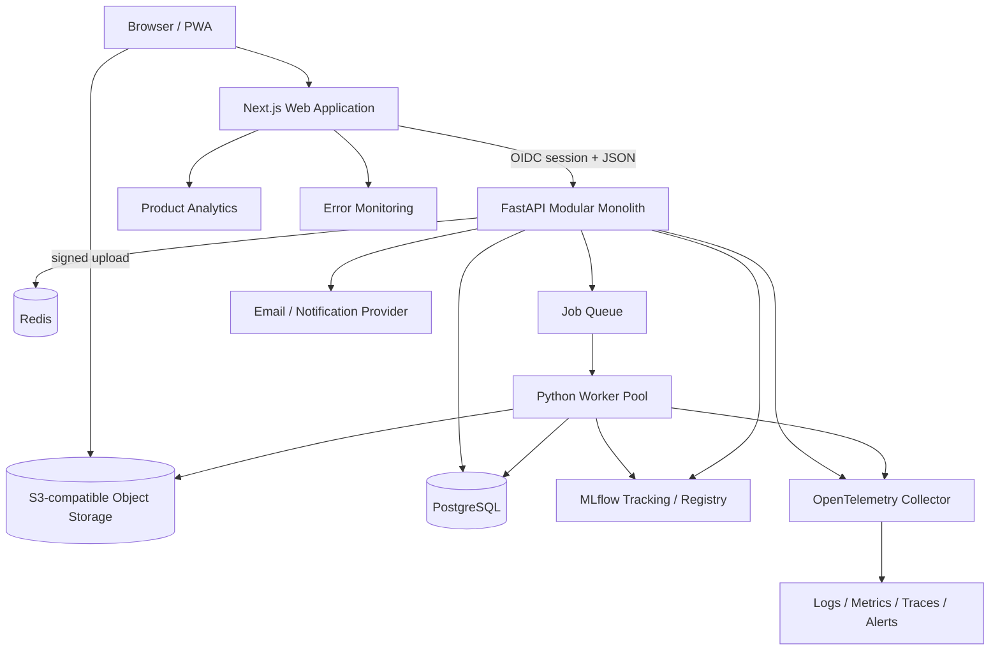

# PulseIQ Africa Technical Architecture and Delivery Blueprint

## 1. Architecture strategy

Use two deliberate product stages:

1. **Stabilized prototype:** keep Streamlit long enough to validate terminology, mappings, rules, and reviewer workflows. Add strict validation, caching, reproducible setup, tests, and disclaimers. Do not call it production lending infrastructure.
2. **Production workspace:** move to a responsive TypeScript web client and a Python modular monolith with asynchronous workers, PostgreSQL, object storage, and versioned analytical/ML artifacts.

Do not start with microservices. The domain boundaries are not yet stable, the team/budget is unknown, and distributed operations would slow learning.

## 2. Proposed high-level architecture



### Runtime responsibilities

| Component | Responsibility | Must not own |
|---|---|---|
| Next.js web | Routes, accessible interaction, server-rendered shell, client state, visualization | Business truth, model logic, raw secrets |
| FastAPI app | AuthZ, domain commands/queries, validation, audit events, job orchestration | Heavy training/file processing in request thread |
| Worker | Ingest, transform, quality, aggregation, anomaly runs, training, reports, email | User authorization decisions without signed job context |
| PostgreSQL | Transactional metadata, tenancy, workflow state, definitions, audit references | Raw multi-million-row CSV blobs |
| Object storage | Original uploads, normalized Parquet, model/report artifacts | Searchable authorization metadata |
| Redis/queue | Short-lived cache, rate limits, job coordination | Source of truth |
| MLflow | Experiment, dataset, parameter, metric, artifact, and approved model lineage | Final lending decisions |

## 3. Modular monolith boundaries

```text
identity/          organizations, users, membership, roles
workspaces/        locale, policy, settings, entitlements
datasets/          sources, versions, uploads, mappings, validation
quality/           quality definitions, runs, issues, remediation
portfolio/         customers, applications, transactions, loans, repayments, KPIs
risk_rules/        rulesets, versions, anomaly runs, alerts, cases
models/            feature contracts, training, evaluation, registry links
decisions/         scores, policy recommendations, human decisions, overrides, appeals
reports/           templates, snapshots, jobs, files, schedules, deliveries
assistant/         intent, governed tools, evidence, feedback
integrations/      storage, email, accounting/payment/data connectors
notifications/     in-app/email delivery and preferences
audit/             append-only security and business audit events
analytics_events/  privacy-safe product event outbox
```

Enforce boundaries through service interfaces and import rules. Modules may share one database initially, but tables include `organization_id`/`workspace_id` and domain ownership.

## 4. Core state machines

### Dataset version

```text
created -> upload_pending -> uploaded -> scanning -> mapping_required
mapping_required -> validating -> ready -> processing -> active
any pre-active state -> failed | quarantined | cancelled
active -> superseded -> archived -> deleted (subject to retention/legal hold)
```

### Job

```text
queued -> running -> succeeded
queued/running -> cancelling -> cancelled
queued/running -> failed -> retry_queued
failed -> permanently_failed
```

Every retry is idempotent by job type + input version + configuration version + request key.

### Alert/case

```text
alert:new -> acknowledged -> case:triaged -> investigating
investigating -> resolved_true_positive | resolved_false_positive | inconclusive
resolved_* -> closed -> reopened
```

### Model version

```text
draft -> training -> trained -> validation_pending
validation_pending -> approved | rejected
approved -> shadow -> champion | challenger
champion/challenger -> suspended -> retired
```

Training completion never automatically promotes a model.

### Decision

```text
draft -> input_validated -> scored -> policy_evaluated
policy_evaluated -> manual_review | recommendation_ready
manual_review/recommendation_ready -> approved | conditional | declined
approved/conditional/declined -> communicated -> appealed -> reconsidered
any finalized state -> overridden (authorized, reason required, original preserved)
```

### Report

```text
draft -> queued -> generating -> ready -> approved -> delivered
queued/generating -> failed -> retry_queued
ready/approved/delivered -> expired | revoked
```

## 5. Data model

### Identity and governance

- `organizations`: tenant, legal name, country, status.
- `workspaces`: purpose, jurisdiction pack, timezone, base currency, retention policy.
- `users`: external identity subject, status, locale; minimum profile only.
- `memberships`: organization/workspace, role, invitation and revocation metadata.
- `roles` / `permissions`: Admin, Data Steward, Analyst, Risk Reviewer, Approver, Auditor, Read Only.
- `consents_and_notices`: notice version, lawful basis/consent evidence when relevant.
- `audit_events`: actor, action, target, before/after hashes, request/trace ID, timestamp, IP/device policy.

### Data ingestion

- `data_sources`: upload/connector type, configuration reference, owner.
- `datasets`: logical dataset and purpose.
- `dataset_versions`: immutable version, checksum, source URI, schema, row count, period, status.
- `schema_mappings`: source column → governed concept, type, unit, currency, confidence, confirmation.
- `import_jobs`: state, progress, attempts, timings, errors.
- `validation_rules` / `validation_runs` / `validation_issues`.
- `quality_definitions` / `quality_runs`: dimension scores and blocked/warn status.

### Portfolio domain

- `customers`: pseudonymous internal customer key and governed attributes.
- `applications`: amount, purpose, currency, submitted/effective dates, status.
- `loans`: principal, terms, disbursement, maturity, status.
- `repayments`: due/paid dates and amounts.
- `transactions`: signed amount, type/direction, currency, occurred/posted timestamps.
- `feature_snapshots`: point-in-time feature values, sources, event/effective time, hash.
- Raw normalized facts may live as partitioned Parquet initially; materialized aggregates live in PostgreSQL.

### Risk, model, and decision

- `rulesets`, `rule_versions`, `rules`, `threshold_sets`.
- `anomaly_runs`, `rule_evaluations`, `alerts`, `cases`, `case_notes`, `dispositions`.
- `feature_contracts`, `training_datasets`, `training_runs`, `model_versions`, `evaluations`, `model_approvals`.
- `predictions`: immutable model output with model/dataset/feature snapshot/threshold versions.
- `policy_evaluations`: deterministic policy rules and outcome.
- `decisions`: human final decision, role, evidence, reason codes.
- `overrides`, `appeals`, `outcomes`.

### Reporting and integrations

- `report_templates`, `report_jobs`, `report_artifacts`, `report_schedules`, `report_deliveries`.
- `assistant_threads`, `assistant_messages`, `assistant_tool_calls`, `assistant_feedback`; content retention configurable.
- `integrations`, `integration_runs`, `webhook_deliveries`, `notification_preferences`.
- `product_events_outbox`: privacy-reviewed analytics event payloads.

### Data rules

- UUID/ULID primary keys; explicit event and effective timestamps in UTC.
- Store original currency and amount; conversion is a separate versioned fact with source/rate time.
- Never overwrite source or prior prediction/decision snapshots.
- Soft deletion is not a retention strategy; use status plus scheduled physical erasure where permitted.
- Encrypt sensitive values and separate directly identifying data from analytical keys when possible.
- Use database constraints for tenant, status, uniqueness, and referential integrity.

## 6. API surface

All endpoints are versioned under `/v1`, return a standard problem format for errors, accept/return correlation IDs, enforce workspace authorization, support idempotency keys on commands, and paginate collections with stable cursors.

### Identity/workspaces

```text
GET/POST   /organizations
GET/PATCH  /organizations/{id}
GET/POST   /workspaces
GET/PATCH  /workspaces/{id}
GET/POST   /workspaces/{id}/members
PATCH/DELETE /memberships/{id}
GET        /me/permissions
```

### Datasets and quality

```text
POST       /datasets
GET        /datasets
GET        /datasets/{id}
POST       /datasets/{id}/versions/uploads          -> signed URL
POST       /dataset-versions/{id}/upload-complete
GET/PATCH  /dataset-versions/{id}/mapping
POST       /dataset-versions/{id}/validate
POST       /dataset-versions/{id}/activate
GET        /dataset-versions/{id}/quality
GET        /dataset-versions/{id}/issues
GET        /dataset-versions/{id}/error-export
GET        /jobs/{id}
POST       /jobs/{id}/cancel
```

### Portfolio and metrics

```text
GET        /portfolio/kpis?dataset_version=&from=&to=&filters=
GET        /portfolio/trends
GET        /portfolio/segments
GET        /customers
GET        /customers/{id}
GET        /applications
GET        /applications/{id}
```

Metric responses include `definition_id`, value, unit/currency, numerator, denominator, period, filters, freshness, quality status, and source version.

### Alerts and cases

```text
POST       /risk/runs
GET        /risk/runs/{id}
GET        /alerts
GET        /alerts/{id}
POST       /alerts/{id}/acknowledge
POST       /alerts/{id}/cases
GET/PATCH  /cases/{id}
POST       /cases/{id}/notes
POST       /cases/{id}/assign
POST       /cases/{id}/disposition
POST       /cases/{id}/reopen
```

### Models, scoring, and decisions

```text
POST       /models/eligibility
POST       /training-runs
GET        /training-runs/{id}
GET        /model-versions
GET        /model-versions/{id}
POST       /model-versions/{id}/submit-validation
POST       /model-versions/{id}/approve
POST       /model-versions/{id}/promote
POST       /scores
POST       /scores/batches
GET        /predictions/{id}
POST       /decisions
POST       /decisions/{id}/override
POST       /decisions/{id}/appeals
```

### Reports, assistant, audit

```text
GET/POST   /report-templates
POST       /reports
GET        /reports/{id}
POST       /reports/{id}/approve
GET        /reports/{id}/download
GET/POST   /report-schedules
POST       /assistant/queries
POST       /assistant/messages/{id}/feedback
GET        /audit-events
POST       /privacy/export-requests
POST       /privacy/erasure-requests
```

## 7. Ingestion and computation logic

### Upload safeguards

- Per-workspace file/row/column quotas; default planning target 100 MB and 1 million rows pending validation.
- Extension, MIME/signature, delimiter, encoding, decompression-ratio, and malware checks.
- Stream and sample before full parse; never load an unbounded file into a web-worker DataFrame.
- Sanitize filenames and keep storage keys generated, not user supplied.
- Formula-neutralize spreadsheet exports while preserving an explicit raw export for authorized technical users.
- Hash and retain original file according to policy; normalized version is Parquet with typed schema.

### Schema/semantic validation

Each governed concept defines aliases, physical type, domain, allowed null rate, uniqueness, unit/currency, time semantics, bounds, and cross-field rules. Validation output is Block, Warn, or Inform; only policy-approved warnings may be overridden, with actor/reason/audit.

### Quality score

Replace the current cell-count score with six visible dimensions:

| Dimension | Example checks | Default planning weight |
|---|---|---:|
| Completeness | required/critical fields and row coverage | 25% |
| Validity | parseability, bounds, domains, currency/unit | 20% |
| Uniqueness | business keys and duplicates | 15% |
| Consistency | statuses, totals, cross-field and period logic | 15% |
| Timeliness | freshness and observation window | 10% |
| Integrity/fitness | relationships, target sufficiency, leakage, purpose | 15% |

Weights and blocking rules are versioned per dataset purpose. The UI shows dimension scores and issues; one composite score never hides a critical block.

### Compute strategy

- Small jobs may run in-process during prototype stabilization.
- Imports, quality, anomaly runs, training, batch scoring, and reports run as queued jobs in production.
- Persist aggregates/materialized views for common filters.
- Cache only immutable/version-keyed results; include definition/ruleset/model/filter versions in keys.
- Use DuckDB/Polars over Parquet for medium analytical workloads before adding a warehouse.
- Add a warehouse/dbt only when cross-workspace historical analytics or volume justifies it.

## 8. Authorization and tenant isolation

- OIDC/OAuth 2.1 managed identity provider; MFA for privileged roles; SSO when enterprise demand exists.
- Short-lived server sessions with secure, HttpOnly, SameSite cookies; no access token in browser storage.
- RBAC at route/service layer plus PostgreSQL row-level security as defense in depth.
- Every request derives tenant/workspace from authenticated membership, never a trusted client header.
- Service/worker jobs carry signed immutable authorization context and verify resource ownership again.
- Object storage uses tenant-prefixed keys and short-lived signed URLs.
- Separate duties: model builder cannot solely approve promotion; scorer cannot erase audit; admin cannot view raw data unless granted.

## 9. Security and privacy baseline

### Application security

- TLS in transit and managed encryption at rest; customer-managed keys only when required.
- Central secrets manager; no `.env` or Streamlit secrets in source/deploy images.
- Input allowlists, parameterized SQL/ORM, output encoding, CSRF/session protection, CSP, secure headers.
- Rate limits by IP/user/workspace and stricter limits for uploads, training, assistant, and exports.
- Signed webhook verification, replay protection, retry/dead-letter policy.
- Dependency lock, SBOM, provenance, secret scan, SAST, dependency/container scan, and signed images.
- Backups encrypted and restore-tested; incident logging excludes raw PII and model inputs.
- Threat model upload, cross-tenant access, model artifact deserialization, CSV formula injection, prompt/tool injection, poisoned training data, membership takeover, report leakage, and audit tampering.

### Privacy/compliance requirements

This is product planning, not legal advice. Before handling real lending data, perform counsel-led scope analysis and a DPIA. The product must support:

- Purpose limitation, minimization, lawful basis/notice, processing records, retention, access, correction, objection/restriction, portability/export, deletion where applicable, and breach response.
- Human intervention, contest/reconsideration, and understandable automated-decision information for significant credit outcomes.
- Country-specific processing/data residency/cross-border rules and controller/processor contracts.
- Data subject and customer complaint workflows.
- Nigerian responsible-lending checks: affordability, credit history, financial difficulty, monitoring, and clear decision authority—not a model score alone.

Planning references include the Nigeria Data Protection Act 2023 (automated-decision safeguards), Kenya Data Protection Act 2019, Rwanda DPP Law Article 21 and DPIA obligations, Ghana Data Protection Commission rights guidance, CBN Consumer Protection Regulations, and the African Union Data Policy Framework.

## 10. Non-functional requirements

Values are proposed release targets and require stakeholder validation.

| Category | MVP target | Growth target |
|---|---|---|
| Availability | 99.5% monthly | 99.9% |
| RPO / RTO | <=1 hour / <=4 hours | <=15 minutes / <=1 hour |
| API latency | reads p95 <500 ms; score p95 <400 ms | reads <300 ms; score <250 ms |
| UI | LCP p75 <2.5 s on representative mobile network; CLS <0.1 | same with higher load |
| Upload | 100 MB, 1M rows asynchronously | configurable; 10M+ through multipart/warehouse path |
| Concurrency | 100 active users / 50 workspaces | 1,000 active / 500 workspaces |
| Job feedback | accepted <1 s; progress heartbeat <=5 s | same |
| Accessibility | WCAG 2.2 AA critical workflows | maintain with regression gates |
| Audit | 100% privileged/risk/model/decision/report actions | tamper-evident archive |
| Security | zero open critical/high release findings or accepted exception | continuous controls |
| Backup verification | quarterly restore test | monthly |

Define SLOs and error budgets after a usage baseline. Degrade gracefully: if analytics is down, the core app remains usable; if model service is unavailable, manual review remains available; if email fails, reports remain downloadable with retry.

## 11. Observability

- Structured JSON logs with timestamp, level, service, environment, trace/request/job IDs, tenant pseudonym, route/job type, status, duration, and safe error code.
- OpenTelemetry traces across web → API → DB/queue → worker → storage/model/report.
- Metrics: request count/error/latency, active sessions, job queue depth/age/failure/retry, upload bytes/parse time, DB pool/query, cache hit, worker resource, report/email delivery, model inference latency/error.
- Business and model metrics belong in governed analytics stores, not Prometheus billing-style counters.
- Alerts: SLO burn, auth anomaly, cross-tenant denial spikes, high error rate, stuck queue, no job heartbeat, backup/restore failure, data drift, prediction distribution shift, delivery failures.
- Dashboards for executive reliability, API, workers, data pipelines, model health, and security.

## 12. Recommended toolchain

### Stabilized prototype

| Need | Tool |
|---|---|
| Environment/lock | `uv` with `pyproject.toml` and lock; pin Python 3.12 |
| Style/lint | Ruff |
| Types | mypy or pyright with gradual strictness |
| Tests | pytest, pytest-cov, Hypothesis, Streamlit AppTest |
| Data contracts | Pandera |
| UI smoke | Playwright + axe |
| Security | pip-audit, Bandit/Semgrep, Gitleaks |
| CI | GitHub Actions |

### Production workspace

| Layer | Recommended default | Alternatives / trade-off |
|---|---|---|
| Web | Next.js + TypeScript | React/Vite if no SSR/public app need |
| UI | accessible headless primitives + Tailwind tokens; Storybook | component vendor may accelerate but constrain style |
| API | FastAPI + Pydantic | Django if admin/ORM breadth outweighs async API simplicity |
| ORM/migrations | SQLAlchemy + Alembic | Django ORM with Django choice |
| DB | Managed PostgreSQL | no document DB need currently |
| Object store | S3-compatible managed storage | cloud-native equivalent |
| Cache/queue | Redis + Celery | Dramatiq/RQ for simpler operations; managed queue for cloud lock-in |
| Analytics compute | pandas/Polars + DuckDB/Parquet | warehouse/dbt after scale demands |
| ML lifecycle | scikit-learn + MLflow + SHAP + Fairlearn | managed ML platform if team/volume justifies cost |
| Product analytics/flags | PostHog with PII allowlist and replay off by default | managed alternative after residency review |
| Errors | Sentry with PII scrubbing | OpenTelemetry backend only |
| Telemetry | OpenTelemetry + Prometheus/Grafana-compatible backend | managed APM to reduce ops |
| Email | SES/Resend/SendGrid behind adapter | choose on country deliverability/cost |
| Containers | Docker, non-root, read-only filesystem where possible | platform buildpacks for speed |
| Deploy | Managed container platform + managed Postgres/storage | choose AWS/GCP/Azure/Render/Fly after residency, budget, skills |
| IaC | Terraform/OpenTofu after production account exists | platform config for prototype |

Do not add Kafka, Kubernetes, Elasticsearch, feature store, graph DB, or microservices until a measured requirement exists.

## 13. Testing strategy

### Unit and property tests

- Column normalization collisions, encodings, delimiters, null tokens, dates, currencies, signs, aliases.
- Quality dimension formulas and block/warn thresholds.
- Every KPI definition with missing/invalid/zero/negative/multi-currency cases.
- Every anomaly rule at below/equal/above threshold and multi-trigger severity.
- Model target provenance, feature eligibility, threshold bands, reason fidelity.
- Assistant intent and tool authorization.
- Report escaping, metadata, pagination, deterministic snapshot.
- Property/fuzz tests for parsers, normalization, CSV export safety, and tenant IDs.

### Integration/contract tests

- API schemas, DB constraints/RLS, migrations, signed upload, job idempotency/retry, object access, email/webhook.
- Worker failure, cancellation, duplicate delivery, stale job, poison message, partial storage failure.
- Model registry lineage and approved-version loading.
- Restore from backup and migration rollback/forward-fix.

### Model validation tests

- Temporal/group split, class/sampling sufficiency, leakage scan, baseline comparison, cross-validation stability.
- Calibration, threshold cost, subgroup performance, missingness, drift, out-of-distribution behavior.
- Explanation fidelity and prohibited/proxy feature review.
- Golden prediction fixtures and champion/challenger regression.

### UI/accessibility/E2E

- Golden paths, role boundaries, back/filter state, empty/loading/error/partial/offline.
- 320/375/768/1024/1440 widths, landscape, zoom, large text, slow network.
- Keyboard, focus, screen reader, reduced motion, contrast, chart table fallback.
- Upload invalid file → recovery; alert → disposition; train → approve; score → override; report → deliver.

### Security/performance

- SAST/dependency/secret/container scan, authorization matrix, tenant isolation, upload abuse, CSV injection, CSRF, rate limits.
- Load and soak tests for reads, score, queue, large upload, export, and report; query plans and memory budgets.

## 14. CI/CD and environments

### Environments

- Local: seeded synthetic data only.
- Preview: per-pull-request, isolated, no production credentials/data.
- Staging: production-like, anonymized/synthetic, integration sandbox.
- Production: least privilege, controlled migrations, break-glass access, audited support.

### Pipeline gates

1. Format/lint/type/unit tests.
2. Secret/dependency/SAST/license scans and SBOM.
3. Build immutable artifacts and sign/provenance them.
4. Integration/API migration tests.
5. UI/E2E/accessibility smoke.
6. Model/data contract regression where relevant.
7. Deploy preview/staging; health/smoke.
8. Manual approval for production and model/policy changes.
9. Rolling/canary release with automatic rollback criteria.

Use expand/contract database migrations. Feature flags do not bypass authorization or compliance review.

## 15. Delivery roadmap

### Phase 0 — Decide and measure (1–2 weeks)

- Confirm launch market, buyer, workflow, decision authority, source files, scale, budget, and legal role.
- Run user/data interviews and collect anonymized representative schemas.
- Complete DPIA/threat-model kickoff and metric glossary.
- Accept architecture ADRs and NFR targets.

**Exit:** signed product brief, data dictionary, risk register, success measures, release scope.

### Phase 1 — Stabilize current app (2–4 weeks)

- Lock environment and add CI/tests.
- Introduce schema mapping/validation and no-silent-default semantics.
- Correct KPI names/definitions and risk provenance.
- Fix navigation, errors, caching, safe export, accessibility basics, and report metadata.
- Add privacy notice and non-production decision disclaimer.

**Exit:** reproducible portfolio/demo app; no P0 correctness bug; rendered cross-device audit passed.

### Phase 2 — Production foundation (4–8 weeks)

- Identity, organizations/workspaces, RBAC, PostgreSQL, object storage, audit.
- Dataset/version/mapping/quality workflow and queued jobs.
- Production web shell and core overview/data pages.
- Observability, backups, retention, security pipeline.

**Exit:** secure multi-user staging with tenant-isolation evidence and restore test.

### Phase 3 — Risk operations and reporting (4–6 weeks)

- Versioned rules, anomaly runs, alert/case queue, assignment/disposition.
- Governed KPI/portfolio filters and accessible drill-down.
- Report templates, approval, schedule, delivery, audit.

**Exit:** reviewer can complete end-to-end data → alert → case → report workflow.

### Phase 4 — Governed ML decisions (6–10 weeks)

- Eligibility, point-in-time features, training jobs, MLflow lineage.
- Validation/calibration/fairness/model cards/approval/shadow/champion.
- Scoring, policy separation, human decision, override/appeal/outcome capture.

**Exit:** independently validated model can support—not automate—a controlled decision workflow.

### Phase 5 — Assistant and integrations (4–8 weeks)

- Deterministic governed query tools and evidence-linked assistant.
- Optional LLM only after privacy, evaluation, cost, and prompt/tool-injection controls.
- Prioritized file/storage/accounting/payment connectors and notifications.

**Exit:** assistant passes factuality/permission tests; connector retries and reconciliation are proven.

### Phase 6 — Scale by evidence (ongoing)

- Performance tuning, warehouse/connectors, regional packs, SSO, enterprise controls.
- Split modules/services only when team ownership, fault isolation, or independent scale is measured.

## 16. Team and ownership

Minimum delivery ownership—not necessarily full-time headcount:

- Product lead/domain owner with credit/SME finance expertise.
- Product designer/researcher with accessibility competence.
- Frontend engineer.
- Backend/data engineer.
- ML engineer/data scientist.
- QA automation engineer.
- Security/privacy owner and external local counsel/compliance reviewer.
- Platform/SRE ownership as production begins.

Critical controls require named owners: metric glossary, data contracts, rules/thresholds, model validation, decision policy, privacy, incident response, and release approval.

## 17. Definition of done

A production capability is done only when:

- Requirements and acceptance criteria are approved.
- Domain logic is versioned, tested, observable, and documented.
- Error, empty, permission, timeout, stale, and recovery paths work.
- Tenant authorization and audit events are verified.
- Privacy/security review and threat-model items are resolved or formally accepted.
- WCAG 2.2 AA critical flow checks pass.
- Metrics/events and dashboards exist without raw PII.
- Runbook, alert, backup/restore, rollback, and support ownership exist.
- User validation shows the intended task can be completed and understood.
- Model/rule/report changes retain lineage and approval evidence.
