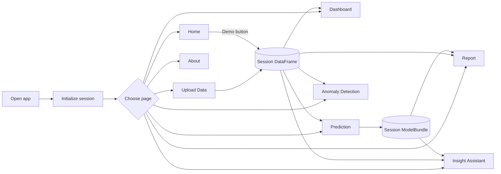

# Reverse-Engineered Specification: PulseIQ Africa

## Document status

- Status: planning baseline
- Scope: commit `04b1005` on branch `master`
- Evidence date: 2026-08-25
- Evidence: every tracked source, configuration, script, README, and the 5,000-row demo CSV
- Vocabulary: **Observed** is implemented, **Inferred** is supported by repository intent, and **Proposed** belongs in the target plan rather than this specification.
- Runtime verification: data, analytics, anomaly, assistant, and PDF paths executed successfully. Full smoke and rendered-browser tests are blocked because the repository has no locked environment and the available runtime lacks Streamlit and scikit-learn.

## 1. Product intent

PulseIQ Africa is a single-user decision-intelligence prototype for SME operators and financial reviewers. It accepts CSV records, normalizes headers, reports basic quality statistics, derives business KPIs, visualizes portfolio patterns, applies transparent suspicious-activity rules, trains one of three credit-default classifiers, scores an individual application, generates rule-based narrative answers, and exports a PDF summary.

The code positions the model as decision support rather than an autonomous approval engine. The README explicitly warns that a target derived from input features is only suitable for exploration and does not establish predictive validity.

## 2. Technology and deployment model

| Concern | Observed implementation | Evidence |
|---|---|---|
| UI/runtime | Streamlit, one root `app.py` | `app.py:31-36`, `app.py:418-436` |
| State | Per-browser-session in-memory `st.session_state` | `app.py:39-55` |
| Data | pandas and NumPy; CSV only | `src/pulseiq/data.py:52-63` |
| Charts | Plotly Express | `app.py:184-216` |
| ML | scikit-learn pipelines | `src/pulseiq/model.py:87-157` |
| PDF | ReportLab, US Letter page | `src/pulseiq/report.py:22-41` |
| Assistant | Deterministic keyword routing | `src/pulseiq/assistant.py:12-75` |
| Persistence | None | README limitations |
| Authentication/authorization | None | README limitations and roadmap |
| Background jobs/API | None | full repository scan |
| Deployment guidance | Streamlit Community Cloud or Hugging Face Spaces | `README.md:70-74` |

The current runtime is a prototype monolith. A user interaction reruns the Streamlit script; dataset and trained model objects remain only in the current session.

## 3. Module map

```text
app.py                         Streamlit composition and eight pages
src/pulseiq/data.py            CSV loading, normalization, demo generation, quality score
src/pulseiq/analytics.py       KPIs, aggregations, narrative insights, currency formatting
src/pulseiq/anomaly.py         Transparent suspicious-record rules and summary
src/pulseiq/model.py           Feature preparation, training, evaluation, scoring
src/pulseiq/assistant.py       Rule-based question router
src/pulseiq/report.py          PDF report builder
src/pulseiq/ui.py              CSS and simple presentation helpers
scripts/generate_demo_data.py  Deterministic demo CSV generator
scripts/smoke_check.py         Happy-path end-to-end assertions
```

## 4. Runtime and navigation flow



The Home “Go to upload page” control does not navigate. It writes an unused `_nav_hint` and tells the user to use the sidebar (`app.py:97-99`).

## 5. Observed functional requirements

### 5.1 Session and navigation

**OBS-NAV-001 — Session initialization**  
When a session starts, the system shall initialize `data`, `data_source`, and `model_bundle` if absent (`app.py:39-43`).

**OBS-NAV-002 — Workspace navigation**  
The system shall expose Home, Upload Data, Dashboard, Prediction, Anomaly Detection, Report, Insight Assistant, and About Project through a sidebar radio (`app.py:58-79`).

**OBS-NAV-003 — Demo reset**  
When demo data is loaded, the system shall replace the current DataFrame, set its source label, and clear the trained model (`app.py:45-49`).

**OBS-NAV-004 — Data guard**  
When a data-dependent page is opened without a dataset, the system shall display an informational message and stop rendering that page’s analysis (`app.py:159-164`, `223-228`, `284-289`, `331-336`, `367-372`).

### 5.2 CSV ingestion and schema normalization

**OBS-DATA-001 — Upload type**  
The system shall present a single-file uploader restricted by extension to CSV (`app.py:122-141`).

**OBS-DATA-002 — Header normalization**  
When a CSV is loaded, the system shall trim and lowercase headers, replace non-alphanumeric runs with underscores, collapse repeated underscores, and use `unnamed` when the result is empty (`src/pulseiq/data.py:26-32`).

**OBS-DATA-003 — Duplicate headers**  
When normalized headers collide, the system shall suffix later occurrences with `_2`, `_3`, and so forth (`src/pulseiq/data.py:35-49`).

**OBS-DATA-004 — Upload failure**  
When pandas raises while reading an upload, the system shall display the raw exception text in a Streamlit error (`app.py:129-136`).

**OBS-DATA-005 — Flexible schema**  
The system shall allow a dataset with no required domain columns and shall substitute zeros, medians, or generic defaults in downstream logic.

### 5.3 Data quality

**OBS-QUAL-001 — Counts**  
The system shall calculate rows, columns, missing cells, and fully duplicated rows (`src/pulseiq/data.py:66-85`).

**OBS-QUAL-002 — Score formula**  
The system shall calculate quality as:

```text
100
- 55 * missing_cells / max(rows * columns, 1)
- 35 * duplicate_rows / max(rows, 1)
- 8 when columns < 6
```

and clamp the result to `[0, 100]` (`src/pulseiq/data.py:69-84`).

**Observed consequences:** an empty DataFrame scores 92%; a one-row three-column file with invalid numeric strings scores 92%; validity, uniqueness by business key, date parseability, required-field coverage, freshness, currency, unit consistency, and target fitness are not measured.

### 5.4 KPI and chart logic

**OBS-KPI-001 — Numeric coercion**  
Where a numeric field exists, the system shall coerce invalid values to null and median-impute them; where the field is absent or entirely invalid, it shall create a constant default series (`src/pulseiq/analytics.py:10-16`).

**OBS-KPI-002 — Top-level KPIs**  
The system shall expose records processed, transaction amount sum labeled total revenue, unique customer count or row count fallback, average transaction amount, repayment rate, high-risk record count labeled high-risk customers, suspicious record count, and the quality metrics (`src/pulseiq/analytics.py:19-47`).

**OBS-KPI-003 — Repayment fallback**  
Where `defaulted` is absent, the system shall substitute zero for every row and therefore report 100% repayment for a non-empty dataset.

**OBS-KPI-004 — Monthly values**  
Where `date` exists, the system shall parse it, convert it to monthly periods, sum `transaction_amount`, and sort by month; otherwise it shall group all rows under `Unknown` (`src/pulseiq/analytics.py:50-62`).

**OBS-KPI-005 — Repayment breakdown**  
Where `repayment_status` exists, the system shall count its labels; otherwise it shall map numeric default values to Repaid/Defaulted (`src/pulseiq/analytics.py:73-80`).

**OBS-DASH-001 — Dashboard**  
When a dataset is active, the Dashboard shall recompute anomaly results and present eight KPIs, monthly transaction trend, repayment status, optional segment totals, live anomaly risk distribution, transaction histogram, anomaly category summary, and up to seven narrative insights (`app.py:159-220`).

No dashboard filter, date range, comparison period, KPI definition, target, drill-down, table alternative, or export exists.

### 5.5 Narrative insight rules

**OBS-INS-001 — Segment insight**  
Where both segment and transaction amount exist, the system shall name the segment with the highest summed transaction amount (`src/pulseiq/analytics.py:93-99`).

**OBS-INS-002 — Suspicious-rate narrative**  
The system shall call suspicious activity “high” above 15%, recommend focused review above 0%, and say none were flagged at 0% (`src/pulseiq/analytics.py:101-109`).

**OBS-INS-003 — Repayment narrative**  
The system shall call repayment healthy at 85% or above, moderate at 65–84.9%, and weak below 65% (`src/pulseiq/analytics.py:111-117`).

**OBS-INS-004 — Quality narrative**  
The system shall recommend cleaning below 90% and call the dataset strong enough for exploration at or above 90% (`src/pulseiq/analytics.py:119-123`).

**OBS-INS-005 — Model narrative**  
Where metrics exist, the system shall add F1 and ROC-AUC statements without confidence intervals, baseline comparison, sample size, target provenance, or calibration (`src/pulseiq/analytics.py:125-131`).

**OBS-INS-006 — Top anomaly pattern**  
Where live flags exist, the system shall report the most frequent first-trigger category (`src/pulseiq/analytics.py:133-137`).

### 5.6 Anomaly detection

All rules are hard-coded, dataset-relative, and median-impute missing numeric inputs (`src/pulseiq/anomaly.py:24-82`).

| Rule | Trigger | Primary evidence |
|---|---|---|
| Unusually high amount | `amount > max(mean * 4.5, q99.2)` | `anomaly.py:44-45` |
| Duplicate customer details | duplicate transaction ID; else customer/date/amount; else full row | `anomaly.py:47-53` |
| Sudden spending spike | amount > segment median * 4.2, or overall median * 4.2 | `anomaly.py:55-60` |
| High-risk repayment pattern | repayment score < 36 | `anomaly.py:62` |
| Loan-to-income mismatch | loan > income * 2.15 | `anomaly.py:63` |
| Multiple transactions in short time | frequency > max(q99.2, mean + 2.4 std) | `anomaly.py:64` |
| High existing debt | debt > income * 0.82 | `anomaly.py:65` |

**OBS-ANO-001 — Multi-rule notes**  
When more than one rule matches, the system shall retain every label in semicolon-separated `anomaly_notes` but shall use only the first matching rule as `suspicious_category` (`anomaly.py:67-81`).

**OBS-ANO-002 — Severity**  
The system shall assign Low for one matched rule, Medium for two, High for three or more, and Normal for zero, regardless of rule severity (`anomaly.py:76-80`).

**OBS-ANO-003 — Score**  
The system shall calculate a 0–100 anomaly score from issue count, amount percentile rank, repayment pressure, and debt-to-income pressure (`anomaly.py:67-71`).

**OBS-ANO-004 — Review/export**  
The Anomaly page shall show live totals, a category/risk chart, the first 250 flagged rows, and a CSV export of all flagged rows (`app.py:284-328`).

The label “Duplicate customer details” can actually mean duplicate transaction IDs. Exported user-originated spreadsheet cells are not protected against CSV formula injection.

### 5.7 Prediction training

**OBS-ML-001 — Feature contract**  
The system shall prepare six numeric features (`income`, `loan_amount`, `repayment_history_score`, `existing_debt`, `transaction_frequency`, `account_age_months`) and four categorical features (`employment_status`, `segment`, `business_type`, `region`) (`model.py:12-21`).

**OBS-ML-002 — Missing-feature defaults**  
Where a feature is missing or entirely invalid, the system shall silently substitute hard-coded constants; where a numeric feature is partially missing, it shall median-impute it; where a categorical feature is missing, it shall use `Unknown` (`model.py:34-64`).

**OBS-ML-003 — Target selection**  
The system shall use `defaulted` when present; otherwise labels containing default, late, failed, or missed in `repayment_status`; otherwise it shall derive the target from repayment score <48, loan/income >1.65, or debt/income >0.72 (`model.py:65-75`).

**OBS-ML-004 — Single-class fallback**  
When the selected target contains fewer than two classes, the system shall derive a second target using loan/income >1.55, debt/income >0.62, or repayment score <45 (`model.py:99-102`, `160-164`). The derived target can still be single-class and is not revalidated.

**OBS-ML-005 — Split and transform**  
The system shall randomly split 25% for testing when there are at least 80 rows and 35% otherwise, stratifying only when the smallest class contains at least two rows; it shall standardize numeric features and one-hot encode categories (`model.py:103-118`).

**OBS-ML-006 — Candidates**  
The system shall train balanced Logistic Regression, Random Forest, and Decision Tree candidates with fixed hyperparameters (`model.py:120-144`).

**OBS-ML-007 — Selection**  
The system shall rank candidates on the same test split by F1 then ROC-AUC and return the top candidate, metrics, confusion matrix, leaderboard, and feature list (`model.py:146-157`).

**OBS-ML-008 — Metrics**  
The system shall report accuracy, precision, recall, F1, and ROC-AUC rounded to three decimals; undefined ROC-AUC shall become 0 (`model.py:167-180`).

There is no minimum sample or positive-class count, grouped/temporal split, cross-validation, independent validation set, calibration, threshold optimization, fairness assessment, drift analysis, model registry, dataset/version lineage, approval workflow, or monitoring.

### 5.8 Individual scoring and decision support

**OBS-SCORE-001 — Form inputs**  
After training, the system shall collect the ten model features through a Streamlit form with fixed category lists and default numeric values (`app.py:258-273`).

**OBS-SCORE-002 — Probability bands**  
When score >=70%, the system shall return Review manually; from 45% through 69.9%, Approve with conditions; below 45%, Likely approve (`model.py:183-198`).

**OBS-SCORE-003 — Reason generation**  
The system shall generate reasons from four independent hand-coded checks—loan/income >1.4, debt/income >0.55, repayment score <50, and employment in Informal/Unemployed—rather than from the fitted model (`model.py:200-218`).

The displayed reason can therefore disagree with the actual model contribution. No adverse-action reason code, override, appeal, reviewer identity, or decision audit is stored.

### 5.9 Insight assistant

**OBS-AST-001 — Intent routing**  
The system shall lowercase and strip punctuation, then use ordered substring tests for biggest risk, next action, flag reason, revenue, quality, model performance, and segment/customer questions (`assistant.py:21-75`).

**OBS-AST-002 — Flag explanation**  
When asked why a transaction was flagged without a record identifier, the system shall explain only the highest-scoring flagged record (`assistant.py:38-45`).

**OBS-AST-003 — Fallback**  
When no intent matches, the system shall return a generic workflow summary (`assistant.py:75`).

No chat history, permissions, record selection, citations, semantic parsing, answer confidence, feedback, or unsafe-query handling exists.

### 5.10 PDF report

**OBS-RPT-001 — Generation**  
When the Report page renders with data, the system shall recompute anomalies/KPIs/insights and synchronously build a PDF before showing the download control (`app.py:331-364`).

**OBS-RPT-002 — Contents**  
The PDF shall include a fixed title/subtitle, dataset KPI table, insights, optional selected-model metrics, grouped suspicious-activity counts, four fixed recommendations, and a generator footer (`report.py:66-127`).

The report does not include organization identity, dataset/source/version, reporting period, generation timestamp, filters, charts, model/threshold/ruleset version, target provenance, methodology, disclaimers, reviewer sign-off, confidentiality label, page numbering, accessibility tags, or a decision audit trail.

## 6. Verified demo baseline

| Measurement | Verified value |
|---|---:|
| Rows / columns | 5,000 / 19 |
| Unique customer IDs | 2,628 |
| Date range | 2025-01-01 to 2026-05-31 |
| Missing values | 37 (20 income, 17 employment status) |
| Duplicate rows / transaction IDs | 10 / 10 |
| Stored demo default rate | 9.64% |
| Quality score | 99.9% |
| Transaction amount sum | NGN 233,495,485 |
| Live anomaly flags | 740 (14.8%) |
| Stored demo suspicious labels | 2,164 (43.28%) |
| Both stored and live flagged | 714 |
| Stored-only / live-only | 1,450 / 26 |
| Live severity | 715 Low, 23 Medium, 2 High |
| Load / anomaly / KPI / PDF time | ~37 / 39 / 34 / 50 ms |
| PDF size | 4,002 bytes |

Stored demo risk, live rule risk, and fitted model risk are separate concepts but share overlapping labels without provenance in the UI.

## 7. Observed non-functional properties

### Security and privacy

- No identity, tenant boundary, role, audit trail, consent, retention, or deletion workflow.
- Uploaded financial/PII data is sent to the Streamlit server and held in session memory.
- File-extension filtering is not a security guarantee; no size override, MIME/signature validation, schema allowlist, malware scan, rate limit, or resource quota is configured.
- Raw parsing exceptions can reveal implementation details.
- CSV exports can preserve spreadsheet formulas supplied by an uploader.
- Unsafe HTML is enabled for static application strings. The current call sites are not user-controlled, but future reuse could introduce injection (`ui.py:105-123`).
- No dependency lock, security scan, SBOM, CI policy, secrets validation, or vulnerability response process.

### Reliability and error handling

- Upload parsing has a broad UI exception handler; model training, scoring, charts, report generation, and assistant paths do not.
- No timeout, retry, cancellation, progress checkpoint, idempotency, job status, circuit breaker, or graceful degradation.
- A page refresh/session loss discards the dataset and model.
- There are no backups because there is no persistent application state.

### Performance

- The full Streamlit script reruns after interactions.
- Anomalies, KPI calculations, charts, and report generation are not cached.
- Model training is synchronous and session-local.
- Every `get_data()` copies the entire DataFrame.
- Dense one-hot encoding can grow sharply with uploaded category cardinality.
- Dashboard and review tables are not paginated server-side.

### Accessibility and UX

- Navigation is a sidebar radio with no stable deep URLs or breadcrumbs.
- The Home secondary CTA does not navigate.
- Plotly charts have no visible data-table alternative or narrative accessibility summary.
- Eight KPI cards and multiple two-column charts have no repository evidence of 375px/landscape testing.
- There is no focus-management logic after navigation/errors or reduced-motion-specific behavior.
- `#18A999` against white has a measured 2.93:1 contrast ratio and must not be used for normal white-on-teal text; `#D95D39` against white is 3.77:1.
- Light theme, typography, spacing, and card styling are partially tokenized, but component states, z-index, motion, chart palette, dark mode, and responsive rules are not.
- The sidebar applies white text to every descendant, which can affect third-party widget state contrast.

### Testability and delivery

- One smoke script tests the demo happy path with broad assertions.
- No unit, integration, UI, accessibility, security, property, load, model-regression, or PDF snapshot tests.
- Dependencies use lower bounds only; there is no lockfile for Python.
- `package-lock.json` contains no packages and has no corresponding `package.json`.
- No CI/CD, container, health check, environment template, migration system, or release process exists.

## 8. Priority defects and risks

| Priority | Finding | Impact |
|---|---|---|
| P0 | Missing/invalid domain fields silently become valid-looking defaults | False KPIs and credit decisions |
| P0 | No human-review/audit/appeal controls around credit scoring | Legal, fairness, and consumer harm risk |
| P0 | No auth, tenancy, access control, or data-governance controls | Financial/PII exposure |
| P0 | Risk labels have no source/version provenance | Contradictory decisions and untraceable review |
| P0 | Empty/invalid data can receive 92% quality and 100% repayment | Materially misleading output |
| P1 | Random single holdout is reused for model selection | Optimistic/unstable metrics |
| P1 | Model reasons are disconnected from the model | Misleading explanation/adverse action |
| P1 | Multi-currency African records are summed and labeled NGN revenue | Invalid business KPI |
| P1 | Synchronous session-local training and report work | Poor reliability and scale |
| P1 | No dependency lock/reproducible runtime | Build and release failure |
| P1 | CSV export formula injection risk | Reviewer workstation compromise |
| P2 | Home navigation CTA is nonfunctional | Broken activation path |
| P2 | Anomaly primary category hides secondary triggers | Incomplete triage context |
| P2 | Charts lack filters, definitions, table fallback, and comparison | Low decision usability/accessibility |
| P2 | Report lacks provenance, time range, methodology, and approval | Weak audit/report value |

## 9. Inferred acceptance criteria for stabilization

**AC-STAB-001 — Reject unusable data**  
Given an empty file, missing required mapping, or a critical column with no parseable values, when validation runs, then analysis and training remain blocked and the user receives field-specific recovery guidance.

**AC-STAB-002 — No silent financial defaults**  
Given a KPI input is absent, when the Dashboard renders, then the metric shows Not available with its missing dependency instead of zero or 100%.

**AC-STAB-003 — Risk provenance**  
Given any risk score or label, when it is displayed or exported, then its source type, version, run timestamp, threshold/ruleset, and explanation are available.

**AC-STAB-004 — Model eligibility**  
Given a dataset lacks an approved target, sufficient rows/classes, or required validation quality, when training is requested, then training is blocked with a measurable eligibility report.

**AC-STAB-005 — Human decision control**  
Given a model score affects a loan decision, when the recommendation is reviewed, then an authorized human can approve, change, or reject it with a required reason and an immutable audit event.

**AC-STAB-006 — Reproducible verification**  
Given a clean machine, when the documented setup runs, then the environment installs from a lock, unit/integration/UI tests execute, and the app starts without manual dependency repair.

## 10. Uncertainties requiring product decisions

1. Is PulseIQ a portfolio demonstration, an internal tool for one lender, or a multi-tenant SaaS product?
2. Is the primary customer an SME owner, credit provider, fintech risk team, or consultant?
3. Which country launches first, and which regulated credit decisions are in scope?
4. Are records transactions, sales, repayments, loan applications, or a mixture? What makes transaction value “revenue”?
5. What currency, period, timezone, and accounting sign convention belongs to each row?
6. What is the authoritative target and observation window for default?
7. What is the cost of a false approval versus false decline, and who owns thresholds?
8. What data may leave a customer’s country, and what retention/deletion terms apply?
9. Should users correct data inside PulseIQ or only map/validate and re-upload?
10. Is the assistant intentionally deterministic or expected to become LLM-backed?
11. What report is legally or operationally required, who signs it, and who receives it?
12. What volume, concurrency, availability, budget, and delivery date must the architecture support?

## 11. Repository-wide coverage statement

All current pages, helpers, formulas, thresholds, input defaults, output artifacts, configuration, scripts, documented limitations, and demo-data properties are covered above. No API routes, migrations, database models, authentication modules, integration clients, job workers, telemetry emitters, or hidden application packages exist in the inspected repository.

## Appendix A — Source symbol traceability

| File / symbol | Observed responsibility or status |
|---|---|
| `app.py:init_state` | Initialize the three primary session keys. |
| `app.py:set_demo_data` | Load demo, set source label, invalidate model. |
| `app.py:get_data` | Return a defensive DataFrame copy or `None`. |
| `app.py:sidebar_nav` | Render eight-page sidebar navigation and demo control. |
| `app.py:page_home` | Hero, broken upload CTA, demo activation, proof metrics, value cards. |
| `app.py:page_upload` | CSV/demo ingestion, quality cards, first-50-row preview. |
| `app.py:page_dashboard` | Live anomalies, KPIs, six possible charts, narrative insights. |
| `app.py:page_prediction` | Synchronous training, leaderboard/metrics/confusion matrix, scoring form. |
| `app.py:page_anomaly` | Live summary, flagged-row review, CSV export. |
| `app.py:page_report` | Synchronous report snapshot/PDF generation and download. |
| `app.py:page_assistant` | Fixed quick questions, custom text input, one rule-based response. |
| `app.py:page_about` | Product/stack description and roadmap items. |
| `app.py:main` | Initialize, style, route selected page. |
| `analytics.py:_numeric` | Numeric coercion plus median/default imputation for KPI logic. |
| `analytics.py:calculate_kpis` | Produce nine dashboard/report measurements. |
| `analytics.py:monthly_revenue` | Parse month and sum transaction amount. |
| `analytics.py:categorical_counts` | Null-safe value counts. |
| `analytics.py:default_breakdown` | Repayment-status counts or binary default mapping. |
| `analytics.py:make_insights` | Up to seven deterministic narrative statements. |
| `analytics.py:format_currency` | Hard-coded `NGN` integer formatting. |
| `anomaly.py:_numeric` | Numeric coercion plus median/default imputation for rules. |
| `anomaly.py:_append_issue` | Append a rule label to matching row issue lists. |
| `anomaly.py:detect_anomalies` | Evaluate seven rules, notes, primary category, severity, and score. |
| `anomaly.py:anomaly_summary` | Group live flags by primary category and severity. |
| `assistant.py:answer_question` | Ordered keyword-intent router and templated response generator. |
| `data.py:DataQuality` | Immutable container for row/column/missing/duplicate/score. |
| `data.py:normalize_column_name` | Convert one header to normalized snake case. |
| `data.py:normalize_columns` | Normalize all headers and suffix collisions. |
| `data.py:load_demo_data` | Read demo CSV or create in-memory fallback. |
| `data.py:load_csv` | pandas CSV read plus header normalization only. |
| `data.py:data_quality` | Compute basic counts and weighted composite formula. |
| `data.py:generate_demo_data` | Generate synthetic records, labels, missingness, and duplicates. |
| `data.py:numeric_columns` | Identify columns with at least 65% numeric-coercible values; currently unused. |
| `data.py:first_existing` | Return first present candidate name; currently unused. |
| `model.py:ModelBundle` | Store selected pipeline, metrics, matrix, leaderboard, features. |
| `model.py:_coerce_numeric` | Numeric coercion and imputation for model features. |
| `model.py:prepare_model_frame` | Assemble ten features and select/derive binary target. |
| `model.py:_one_hot_encoder` | Compatibility factory for old/new scikit-learn sparse option. |
| `model.py:train_models` | Split, preprocess, fit three candidates, evaluate, select. |
| `model.py:_fallback_target` | Derive alternative target after a single-class target. |
| `model.py:_metrics` | Accuracy/precision/recall/F1/ROC-AUC calculation. |
| `model.py:score_customer` | Predict probability, assign decision band, hand-code reasons/action. |
| `report.py:_p` | Escape text and construct a ReportLab paragraph. |
| `report.py:build_report_pdf` | Build the current fixed business-intelligence PDF. |
| `report.py:_table` | Style report tables. |
| `report.py:_cell` | Escape/wrap table cell values. |
| `ui.py:apply_page_style` | Inject global custom CSS with unsafe HTML enabled. |
| `ui.py:hero` | Render static hero HTML. |
| `ui.py:value_card` | Render static value-card HTML. |
| `ui.py:metric_value` | Thin `st.metric` wrapper; currently unused. |
| `ui.py:currency_metric` | Delegate to hard-coded NGN formatter. |
| `ui.py:require_dataset_message` | Render common no-dataset information message. |
| `generate_demo_data.py:main` | Generate and overwrite the deterministic demo CSV. |
| `smoke_check.py:main` | Exercise one happy path through demo, anomalies, KPIs, model, score, insights, PDF, and assistant. |
